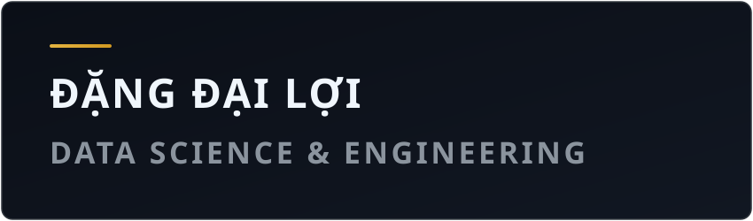

<!-- ========== HEADER BANNER ========== -->

  

    

  <!-- Subtitle Badges -->
  

    
    
    
    
    
  

---

<!-- ========== ABOUT ME ========== -->
## 👨‍💻 About Me

> *"Turning raw data into structured insights & automated pipelines."*

Hey there! 👋 I'm **Đặng Đại Lợi**, currently an undergraduate **Data Science student** at **HUFLIT** (Ho Chi Minh City University of Foreign Languages & Information Technology), with a strong passion for **Data Engineering** and modern data platforms.

- 🎓 **Education:** Undergraduate in **Data Science** @ **HUFLIT** *(In Progress)*
- 🎯 **Aspiration:** Becoming a proficient **Data Engineer**
- 🔭 **What I'm Learning & Building:**
  - Designing automated **ETL / ELT workflows** and scalable data pipelines
  - Relational database schema design with **PostgreSQL & MySQL**, plus NoSQL with **MongoDB**
  - Workflow orchestration and scheduled pipelines using **Apache Airflow**
  - Cloud-native analytics & storage on **Google Cloud Platform (BigQuery)**
  - Containerizing environments with **Docker** & CI/CD workflows with **GitHub Actions**
- ⚡ **Fun Facts & Mindset:**
  - 💡 *“Data is the new oil”* ⛽ — but only truly valuable when refined and structured
  - 🤖 If I have to do something more than twice, I automate it
  - 🌱 Actively building hands-on projects & open to **Data Engineering Internship** opportunities

---

<!-- ========== TECH STACK ========== -->
## 🛠️ Tech Stack

### 💻 Languages

  
  
  
  
  

### 🗄️ Data Engineering & Databases

  
  
  
  
  
  
  
  

### ⚙️ DevOps & Tools

  
  
  
  
  
  

---

<!-- ========== GITHUB STATS ========== -->
## 📊 GitHub Stats

  

---

<!-- ========== SNAKE ANIMATION ========== -->
## 🐍 Contribution Snake

  <picture>
    <source media="(prefers-color-scheme: dark)" srcset="https://raw.githubusercontent.com/DataZenLab/DataZenLab/output/github-snake-dark.svg" />
    <source media="(prefers-color-scheme: light)" srcset="https://raw.githubusercontent.com/DataZenLab/DataZenLab/output/github-snake.svg" />
    
  </picture>

---

<!-- ========== RANDOM QUOTE ========== -->
## 💬 Random Dev Quote

  

